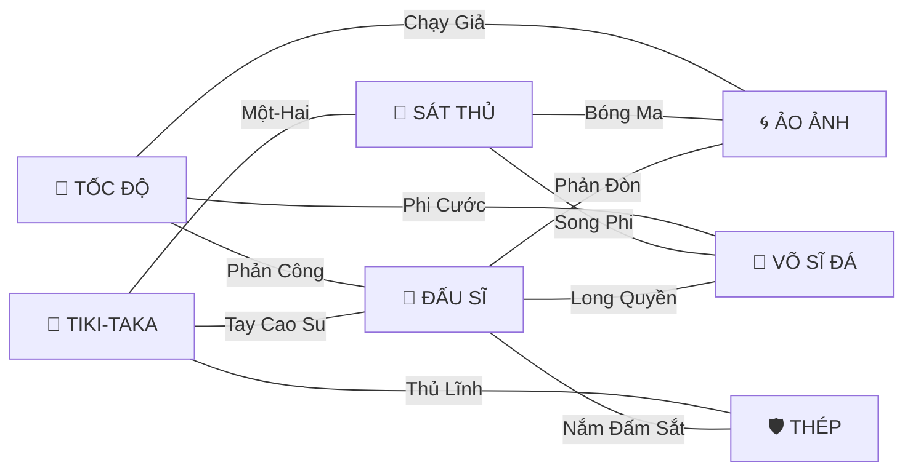

# Core Upgrade — Thiết kế hệ thống build (v2 · visual-first)

> Trạng thái: **ĐÃ DUYỆT (2026-09-27)** — xem *Quyết định đã chốt* ngay dưới. Số liệu là số khởi điểm, sẽ cân bằng lại bằng giả lập.
> **v2 (so với v1):** chuyển trọng tâm sang **đã mắt**. Bỏ các Core "+x% vô hình", mọi Core đều phải là một khoảnh khắc nhìn thấy được;
> Core Đỉnh thành **Tuyệt kỹ** (chủ động, có cinematic); thêm **bộ công cụ hiệu ứng (VFX Kit)** làm nền kỹ thuật. Khung combo của v1 giữ nguyên.

### Quyết định đã chốt

| # | Chủ đề | Quyết định |
|---|---|---|
| 1 | Hướng visual-first, không Core vô hình, ngân sách hiệu ứng | ✅ Theo mục 1–2 |
| 2 | Tuyệt kỹ | Chủ động bằng phím `X`, có thanh năng lượng. **Năng lượng chỉ nạp khi ghi bàn hoặc cướp được bóng** (đấm / đá làm rơi bóng, cắt đường chuyền) — thay cho cách nạp theo tài nguyên ở mục 4 |
| 3 | Cut-in anime dừng hình ~0.4s khi dùng Tuyệt kỹ | Làm thử, đánh giá sau khi chơi |
| 4 | 7 trường phái + Cộng hưởng 2 / 3 / 4 + hình thái bậc 4 | ✅ |
| 5 | Số lượt chọn Core | **5 lượt**: thêm 1 lượt **trước khi giao bóng đầu trận** + 4 lượt sau bàn thắng như cũ |
| 6 | Đổi bài | **Mỗi lượt chọn được đổi 1 lần**, đổi cả 3 lá (không giới hạn theo trận) |
| 9 | Lượt chọn theo thời gian | Cứ `match.draftEvery` giây (mặc định 24s) được +1 lượt, **chỉ mở khi có bàn thắng** (tích nhiều lượt thì chọn liền). Lượt cuối luôn xong **trước FINAL PUSH**: tới đó còn lượt thì tạm dừng trận để chọn. HUD báo "✦ CORE +N · chờ bàn thắng" / "Core tiếp sau 0:12" |
| 10 | Tài nguyên giảm từ từ | Đà / Nhịp / Nộ có thời gian ân hạn rồi mất từng nấc (không về thẳng 0) — `cores.config.js → resources` |
| 11 | Hiển thị năng lượng Tuyệt kỹ | Ô X luôn hiện (kể cả chưa có Tuyệt kỹ) với % + "+20%" bay lên khi nạp; HUD trên có thanh năng lượng cả 2 đội; chữ "+ULT" trên đầu người cướp được bóng |
| 7 | Meta: Core có sẵn 7 lá, hộp theo trường phái, bảo hiểm | ✅ Theo mục 10 |
| 8 | Thứ tự làm | ✅ **VFX Kit + sandbox trước** (giai đoạn 0) |

### Tiến độ triển khai

| Giai đoạn | Trạng thái | Ghi chú |
|---|---|---|
| 0 · VFX Kit + sandbox | ✅ Xong | `src/systems/vfxkit.js`, `src/render/vfx.js`, `sandbox.html` (12 khoảnh khắc nháp) |
| 1 · Khung | ✅ Xong | Trường phái + Cộng hưởng (đủ 21 bonus 2/3/4) + hình thái bậc 4 · tài nguyên Đà / Nhịp / Nộ / Giáp · sự kiện cướp bóng, sút tụ lực, né, BONK, ghi bàn · Tuyệt kỹ (phím X, năng lượng khi ghi bàn / cướp bóng, cut-in, AI tự dùng) · 5 lượt chọn (1 trước giao bóng) + đổi bài mỗi lượt + trọng số build + bảo đảm hướng + Tuyệt kỹ cần ≥ 2 Core cùng trường phái (tối đa 1 Tuyệt kỹ / đội) · độ hiếm hợp nhất (`cores.config.js` → `rarity`) · UI tối thiểu (lá Core có trường phái / tiến độ Cộng hưởng / KHỚP, ô Tuyệt kỹ, bộ đếm tài nguyên, Cộng hưởng trên HUD) · đồng bộ online (protocol 3). **Tuyệt kỹ thí điểm:** `lightning_dash` (Tia Chớp Xuyên Sân) để kiểm tra khung. |
| 2 · Làm lại 16 Core cũ | ✅ Xong | Cả 16 Core cũ (giữ ID) theo bảng mục 6: tên tiếng Việt, độ hiếm theo bảng, hành vi + hình mới. **Tài nguyên nhìn thấy được** trên người cầu thủ (Đà = tia điện dưới chân / sét dọc người khi đầy, Nộ = nắm tay bốc lửa, Giáp = ánh bạc + khiên nhỏ, Nhịp = nốt nhạc quanh đội) · hào quang cầu thủ (`player.glow`) · cờ hình của bóng (`ball.fx`: dây đàn, xoắn rồng, laser, sét, cầu lửa to) · viên gạch mới: khiên lục giác, cổng xoáy, lưới cháy · sự kiện chạy nước rút tính cho cả AI · lưỡi gió / mìn làm rơi bóng = cướp bóng · sandbox có mục **CORE THẬT** · protocol 4 (giai đoạn 3: protocol 5). **Giữ lại tới giai đoạn 5:** mở khoá theo level + bộ Core có sẵn (Da Thép giờ là THƯỜNG nhưng vẫn mở ở LV5). |
| 3 · Core mới | ✅ Xong | Đủ **53 Core** (37 mới, gồm 6 Tuyệt kỹ còn lại) — hành vi ở `src/systems/cores-new.js`. Hạ tầng thêm: `CoreSystem.task` (việc chạy mỗi bước, huỷ khi giao bóng), trạng thái cầu thủ `slam` (nhảy dậm) / `meteor` (lơ lửng ngoài màn hình), tâng người đang bay, nắm đấm khổng lồ (tay co giãn có cỡ), phân thân chặn đường chuyền (`popClone`), trừ tỉ lệ bắt bóng theo cú sút (`ball.gkMod`), bóng xuyên người dùng chung (sét / Song Phi). **Đổi so với bảng:** Xe Ủi / Thủ Môn Khổng Lồ / Nắm Đấm Sắt tự có tối thiểu 1 Giáp mỗi lần giao bóng (tránh lá chết khi chưa có Core tạo Giáp); Húc Xe Tải cần 4 Đà, tiêu 3, hồi 4s; năng lượng Tuyệt kỹ từ cướp bóng +20% và tối đa 1 lần / 2s mỗi đội. Mở khoá theo level đã điền cho Core mới (THƯỜNG LV1 … Tuyệt kỹ LV15–18). **Cần cân bằng ở giai đoạn 6:** build 4 lá TỐC ĐỘ (Quỷ Tốc Độ + Phóng Như Tên + Húc Xe Tải + Tia Chớp) vẫn ~18 bàn/trận khi đá với đội không Core. |
| 4 · UI hoàn chỉnh | ✅ Xong | **Ảnh động xem trước Core** (`src/ui/corepreview.js`): mỗi lá chạy một trận mini thật (`noAI` / `noDraft`, `g.preview`) theo kịch bản riêng của 53 Core, vẽ bằng chính Renderer + VFX Kit, cắt khung 1:1 theo "máy quay", 30 khung/giây, tự dừng khi lá bị gỡ khỏi màn hình — dùng ở lá chọn Core, túi đồ, màn mở hộp, màn kết quả · lá Core: viền 2 màu cho cầu nối, dòng `TẠO: Đà` / `DÙNG: Nộ` (trường phái có `mech`), lá Tuyệt kỹ nền poster + viền vàng chạy + nhãn phím X · ô Tuyệt kỹ đầy thì rung · màn kết quả: **Khoảnh khắc của trận** (Tuyệt kỹ / combo HIT cao nhất, có ảnh động) + nhãn build ("🏃 TỐC ĐỘ IV") · túi đồ: lọc Core theo trường phái (Z / chuột) + **Thường đi cùng** (2–3 Core hợp build) · đổi lá đang chọn không vẽ lại (ảnh động không bị giật). |
| 5 · Meta | ✅ Mở khoá theo Main Path | **Gacha Core vẫn tắt** (`progression.coreGacha = false`, Hộp Core ẩn khỏi SHOP). Core mở theo tiến trình (`mainPath.lockCores`): **12 Core có sẵn** (`progression.starterCores`: 8 THƯỜNG đủ 7 trường phái + 4 HIẾM) · **mỗi sao mới** trong 1 hạng = 1 Core ngẫu nhiên trong `areas[].cores` của Area đó (hết thì `starGold`) · **lên hạng lần đầu** = 1 hộp costume `areas[].divBox` (mở miễn phí trong SHOP) · **thắng trận thăng hạng** = Core đặc trưng của boss `areas[].signature` (7 Tuyệt kỹ + Giant Fist / Black Hole / Scissor Kick); boss chắc chắn cầm Core đó trong trận thăng hạng. Màn **mở thẻ kiểu TCG** (`src/ui/reveal.js`) sau trận · nhãn NEW ở lượt chọn kế tiếp · 🔒 + cách mở trong túi đồ / màn kết quả · bản đồ Main Path hiện thưởng từng hạng. Online vẫn dùng đủ 53 Core. Hồ sơ cũ được cấp bù theo tiến trình (`MainPath.backfill`). |
| 6 · Cân bằng | ✅ Vòng 1 | Giả lập đấu vòng tròn 9 build mẫu + đội không Core (AI vs AI, Core thêm dần mỗi 24s, Tuyệt kỹ lượt cuối) và đo **bỏ từng Core** khỏi build để tìm lá gánh / lá phá build. Kết quả (8 vòng, 144 trận / build): TỐC ĐỘ 65% · TIKI-TAKA 58% · SÁT THỦ 46% · ĐẤU SĨ 46% · VÕ SĨ ĐÁ 42% · ẢO ẢNH 45% · THÉP 60% · lai cao su 63% · lai ninja-sát thủ 64% · không Core 10%. Tuyệt kỹ ~0.7–1 lần / trận. Chỉnh chính: Dậm Đất lao về đối thủ (trước đó nhảy tại chỗ → phá build Võ Sĩ Đá), Long Quyền bóng rơi về chân, Phá Âm Chướng chỉ khi cầm bóng, Húc Xe Tải ≥5 Đà / hồi 15s, Xe Ủi chậm 12% + hất nhẹ hơn, Da Thép hồi 7s, Aegis 60s, Tay Cao Su hồi 2s, Nộ +2% tốc độ mỗi nấc, Thuấn Bộ lừa 1 hậu vệ. Số liệu chỉ là AI vs AI — cảm giác khi người chơi điều khiển cần chơi thử. |
| 7 · Scale theo chỉ số | ✅ Xong | Core scale theo chỉ số character (`src/systems/corescale.js`, số liệu `cores.config.js → statScale`): mỗi trường phái gắn 1 chỉ số (`archetypes[].stat`: TỐC ĐỘ→PACE · SÁT THỦ→SHOOTING · TIKI-TAKA→PASSING · ẢO ẢNH→DRIBBLE · ĐẤU SĨ + VÕ SĨ ĐÁ→FIGHT · THÉP→KEEPER · HỖN LOẠN→OVR; Core cầu nối = trung bình 2 chỉ số). Rating 60 → 80 → 99: **độ mạnh 50% → 100% → 150%**, **hồi chiêu 130% → 100% → 70%**. Mỗi Core khai báo `scale` (param → `pow` / `mul` / `cd`; `m.<mod>` cho mods); số đếm, ngưỡng, điểm trừ không scale. Nhân theo chỉ số **người ra chiêu** (hook có cầu thủ cùng đội ở tham số đầu); hiệu ứng cấp đội: character (đội người chơi) / trung bình đội (AI) → Core của AI mạnh dần theo rating đội qua các Area (65 → 98). Online: character dùng chỉ số đội nên cân bằng. Lá Core ghi **SCALES WITH <chỉ số>**; mô tả dùng placeholder (`{stun}`, `{m.shotPower+%}`...) hiện số đã nhân, **xanh** khi hơn / **đỏ** khi kém mức gốc (rating 80). |
| 8 · Core riêng từng người | ✅ Xong | Core / Cộng hưởng / trạng thái / buff / Tuyệt kỹ thuộc về **từng cầu thủ** (`CoreSystem.own[id cầu thủ]`), kể cả đối thủ. Mỗi lượt chọn Core: người chơi chọn cho character, mọi cầu thủ AI tự bốc 1 lá (đồng đội bốc trong deck riêng — `docs/TEAMMATE_DESIGN.md`). Hook nhận `prm.owner`; truy vấn nhận cầu thủ hoặc số đội (số đội = có ai / người cao nhất). Nhịp vẫn là của đội. Năng lượng Tuyệt kỹ riêng `p.res.ult`. Giả lập: 5.81 bàn / đội / trận (trước 5.76). |

---

## 1. Ba trụ cột

1. **ĐÃ MẮT** — xem cũng vui như chơi. Mỗi Core là một *khoảnh khắc*: người đứng ngoài nhìn cũng hiểu vừa có chuyện gì hoành tráng xảy ra.
   Vibe được phép **điên**: tay cao su vươn dài, phân thân như ninja, dậm đất hất tung cả sân, sút lỗ đen, hoá khổng lồ...
2. **COMBO BUILD** — người chơi nghĩ *"mình đã lấy cái này, cần ra cái kia nữa"*: trường phái + Cộng hưởng, Tạo ↔ Dùng tài nguyên, Tuyệt kỹ cuối đường, Core cầu nối cho build lai.
3. **ĐỌC ĐƯỢC & PHẢN ĐÒN ĐƯỢC** — chiêu càng to càng phải báo trước (gồng, tâm ngắm, callout) để đối thủ kịp né bằng Z; hiệu ứng không được che mất bóng và cầu thủ.

**Luật cứng:** không có Core vô hình. Kể cả Core chỉ số (tăng tốc, tăng lực) cũng phải đổi được thứ gì đó trên màn hình (vệt, hào quang, hình dạng).

> Cảm hứng lấy từ vibe anime / game đối kháng (One Piece, Naruto, Dragon Ball, JoJo, Street Fighter, Bayonetta...) nhưng **tên chiêu và hình ảnh đều là bản gốc của mình**, không dùng tên / hình nhận diện của các IP đó.

---

## 2. Bộ công cụ hiệu ứng (VFX Kit)

Mọi Core ghép từ các "viên gạch" dưới đây → làm 1 lần, dùng cho cả 53 Core. Tất cả nằm trong `Effects` nên trận online tự đồng bộ (host đã ghi lại mọi lệnh effect gửi cho khách).

| Mã | Viên gạch | Mô tả | Hiện có? |
|---|---|---|---|
| `HS` | **Hit-stop** | Đứng hình 50–120ms lúc đòn nặng trúng — cảm giác "nặng tay" | 🆕 |
| `SM` | **Slow-mo** | Làm chậm thời gian (toàn sân hoặc từng người) 0.3–1.5s | 🆕 |
| `ZM` | **Punch-zoom** | Phóng to nhẹ 1.1–1.2× vào điểm va chạm rồi trả về | 🆕 |
| `IF` | **Impact frame** | 1–2 khung hình đảo màu đen/trắng kiểu anime lúc đòn quyết định trúng | 🆕 |
| `SL` | **Speed lines** | Tia tốc độ quét quanh màn hình / quanh người | 🆕 |
| `CO` | **Callout** | Tên chiêu chữ to chạy chéo màn hình; chữ comic (POW / BAM / CLANG) | ◐ (có chữ nổi nhỏ) |
| `SW` | **Shockwave** | Vòng sóng chấn lan rộng, đẩy / hất người trong vùng | ◐ (có vòng nhỏ) |
| `DC` | **Decal** | Dấu vết để lại trên sân / tường vài giây: vết nứt, hố, cháy xém, vết trượt | ◐ (có vệt lửa) |
| `LB` | **Chi co giãn** | Vẽ tay / chân kéo dài co giãn như dây thun tới mục tiêu xa | 🆕 (có tay/chân pixel) |
| `CL` | **Phân thân** | Bản sao cầu thủ tạm thời có AI riêng, va chạm được, nổ khói khi biến mất | ◐ (có ảo ảnh tĩnh, bóng giả) |
| `PJ` | **Đạn / chiêu bay** | Vật thể bay có va chạm: lưỡi gió, quả cầu năng lượng | ◐ (có đường chém) |
| `BM` | **Luồng tia (beam)** | Tia năng lượng rộng bắn thẳng, đẩy người trong luồng | 🆕 |
| `GI` | **Khổng lồ** | Phóng to cầu thủ 1.3–2× (vẽ + va chạm + tầm với) | 🆕 |
| `PL` | **Lực hút / đẩy** | Kéo người / bóng về một điểm (lỗ đen) hoặc đẩy ra | 🆕 |
| `BL` | **Skin bóng** | Bóng đổi hình: cầu lửa, cầu sét, lỗ đen, quả bom, dưa hấu... | ◐ (có bóng lửa / sét) |
| `TR` | **Vệt & tàn ảnh** | Vệt bay theo, tàn ảnh nhân vật | ✅ |
| `PT` | **Hạt** | Bụi, lửa, tia lửa, khói | ✅ |
| `SH` / `FL` | **Rung / loé màn hình** | | ✅ |

### Công thức một khoảnh khắc

Mọi chiêu lớn theo 3 nhịp: **BÁO TRƯỚC → VA CHẠM → DƯ ÂM**.

| Nhịp | Mục đích | Công cụ |
|---|---|---|
| Báo trước (0.2–0.6s) | Đối thủ thấy và né được; khán giả thấy "sắp có biến" | gồng + hào quang, tâm ngắm trên sân, callout, slow-mo ngắn |
| Va chạm | Cảm giác "đã tay" | hit-stop, impact frame, rung, punch-zoom, chữ comic, hạt nổ |
| Dư âm (1–4s) | Dấu vết trên sân kể lại chuyện vừa xảy ra | decal (nứt, hố, cháy), người bay lộn vòng, bộ đếm combo |

### Ngân sách hiệu ứng (để không rối mắt)

- Slow-mo / impact frame: tối đa 1 lần mỗi 4s trên toàn sân; Tuyệt kỹ luôn được ưu tiên.
- Callout lớn: 1 cái trên màn hình một lúc; chữ comic nhỏ tối đa 3.
- Hạt + decal có trần số lượng; decal mờ dần, không che vạch sân / khung thành.
- Bóng và cầu thủ đang điều khiển luôn vẽ trên cùng, có viền để không bị hiệu ứng nuốt.
- **Tuỳ chọn "Giảm nháy"** trong cài đặt: tắt impact frame / loé trắng (an toàn cho người nhạy cảm ánh sáng).

---

## 3. Bảy trường phái

| Trường phái | Hành động gốc | Tài nguyên | Chữ ký hình ảnh |
|---|---|---|---|
| 🏃 **TỐC ĐỘ** | Chạy nước rút | **Đà** — +1 mỗi 0.4s chạy nước rút, tối đa 5; mỗi Đà +1% tốc độ; ngừng chạy 2.5s thì mỗi 0.7s mất 1, bị choáng mất 1 | Tia sét xanh cyan, tàn ảnh, vòng siêu âm |
| 🎼 **TIKI-TAKA** | Chuyền | **Nhịp** — +1 mỗi đường chuyền tới chân, tối đa 5; 6s không chuyền thì mỗi 2.5s mất 1, mất bóng mất 2 | Dải sáng vàng như dây đàn, nốt nhạc, nét phấn bảng chiến thuật |
| 🎯 **SÁT THỦ** | Sút | **Sút tụ lực** (giữ ≥ 60% thanh) · **Bóng nguyên tố** (lửa, sét, xoáy...) | Bóng biến hình nguyên tố, lưới nổ tung |
| 🥊 **ĐẤU SĨ** | Light attack | **Nộ** — +1 mỗi cú đấm trúng, tối đa 5; mỗi Nộ +6% tỉ lệ đấm rơi bóng, +2% tốc độ; 4s không đấm trúng thì mỗi 2s mất 1 | Chữ comic POW, tàn ảnh nắm đấm, tay bốc lửa |
| 🦵 **VÕ SĨ ĐÁ** | Hard attack | **Hất tung** (đối thủ đang bay) · **BONK** (va tường) | Nứt đất, sóng chấn, thiên thạch |
| 🌀 **ẢO ẢNH** | Dash Z | **Ảo ảnh** (để lại sau Z) · **Né** (Z xuyên qua đòn) | Khói ninja, tàn ảnh tím, phân thân |
| 🛡 **THÉP** | Thể lực, sức mạnh, trông khung | **Giáp** — chặn 1 lần bị choáng / đẩy, tối đa 2 | Ánh kim loại, khiên lục giác, hoá khổng lồ |
| 🎲 **HỖN LOẠN** | — | — | Bóng biến hình, cổng dịch chuyển, bom — không có Cộng hưởng, lấy được với mọi build |

### Bản đồ cầu nối

Mỗi trường phái có **8–10 Core** (tính cả cầu nối).

---

## 4. Tuyệt kỹ (Core Đỉnh)

Mỗi trường phái có đúng **1 Tuyệt kỹ** (độ hiếm THẦN THOẠI) — đây là khoảnh khắc "show off" lớn nhất của build.

- **Điều kiện xuất hiện khi chọn Core:** đã có ≥ 2 Core cùng trường phái.
- **Kích hoạt chủ động bằng phím `X`** (phím trống trong trận). Có **thanh năng lượng Tuyệt kỹ** — ô thứ 4 trên thanh kỹ năng, sáng rực khi đầy.
  Năng lượng **chỉ nạp khi ghi bàn hoặc cướp được bóng** (đấm / đá làm rơi bóng, cắt đường chuyền). Hiện tại: ghi bàn +60%, cướp bóng +20% (tối đa 1 lần mỗi 2s mỗi đội).
- Mọi Tuyệt kỹ có **báo trước 0.3–0.5s** (slow-mo nhẹ + callout tên chiêu) → đối thủ có cửa né bằng Z. Né được Tuyệt kỹ cũng là một khoảnh khắc đẹp.
- AI cũng dùng Tuyệt kỹ (đội AI có build Tuyệt kỹ → trận đấu với máy cũng đã mắt).
- **Tuyệt kỹ khởi đầu — `aura_farming` (AURA FARMING, SỬ THI):** "bí kíp gia truyền" ông nội trao ở cuối PROLOGUE (`config/ftue.config.js` → `heirloom`), nằm sẵn trong `progression.starterCores` để người mới có Tuyệt kỹ ngay từ Area đầu. Vẫn là Core như mọi Tuyệt kỹ: phải đủ điều kiện rồi bốc được lá mới có. Khác biệt: `anyBuild` — đủ điều kiện khi có ≥ 2 Core cùng **1 trường phái bất kỳ** (lá ghi ANY BUILD); ở lượt chọn cuối, Tuyệt kỹ của trường phái ngang bằng được ưu tiên hơn. Hiệu ứng yếu có chủ đích: 6s +18% tốc độ chạy / tốc độ chuyền / lực sút (không scale theo chỉ số); tóc hoá vàng dựng ngược + lửa hào quang vàng (`auraFarmT`, đồng bộ online), cut-in vàng **AURA FARMING**.

---

## 5. Cộng hưởng trường phái (set bonus) — kèm "hình thái"

Đếm Core theo trường phái (cầu nối tính cho cả hai). Bậc 4 còn đổi **hình thái** của cả đội — nhìn là biết đội đang theo build gì.

| Trường phái | 2 Core | 3 Core | 4 Core + hình thái |
|---|---|---|---|
| 🏃 TỐC ĐỘ | Đà tối đa +1 | Ở Đà tối đa chạy nước rút tốn ít hơn 25% thể lực | Giữ Đà thêm 2s · mỗi Đà +1% lực sút & chuyền · **cả đội viền tia sét xanh, chân lách tách điện** |
| 🎼 TIKI-TAKA | Nhận bóng +1 Nhịp | Bị cắt 1 lần không mất Nhịp | 5 Nhịp: chuyền không thể bị cắt · **nốt nhạc xoay quanh cả đội, đường chuyền vẽ dây vàng** |
| 🎯 SÁT THỦ | +15% lực sút · sút tụ lực: thủ môn −12% bắt | Ngưỡng tụ lực 60% → 40% | Sút trúng khung: −30% hồi chiêu · **chân bốc lửa thường trực** |
| 🥊 ĐẤU SĨ | Nộ giảm chậm | Đủ 5 Nộ: đấm không hồi chiêu 2s | Đấm trúng hồi thể lực, choáng +50% · **hai nắm tay rực lửa đỏ** |
| 🦵 VÕ SĨ ĐÁ | Hất xa +25% · hồi chiêu Hard −15% · đá trúng người cầm bóng: bóng rơi về chân | BONK gây choáng lan | Hồi chiêu Hard −40% · **mỗi bước chân để lại vết nứt nhỏ** |
| 🌀 ẢO ẢNH | Ảo ảnh +1s · hồi chiêu Z −20% | Né thành công hồi Z | Z có 2 lần dùng · **tàn ảnh tím bám theo thường trực** |
| 🛡 THÉP | +1 Giáp mỗi lần giao bóng | Tự hồi 1 Giáp mỗi 8s | Thủ môn +20% bắt · **cả đội ánh kim loại, bước đi nặng (rung nhẹ)** |

---

## 6. Danh sách 53 Core

**Vai trò:** `TẠO` sinh tài nguyên · `DÙNG` tiêu tài nguyên · `NỀN` chỉ số (vẫn có hình) · `TUYỆT KỸ` (phím X).
**Nguồn:** ♻️ làm lại từ Core cũ (giữ ID để không mất đồ người chơi) · 🆕 mới. **Có sẵn** = Core cơ bản miễn phí.
**Kit** = viên gạch hiệu ứng dùng (mục 2).

### 🏃 TỐC ĐỘ — Đà

| ID | Tên | Độ hiếm | Vai trò | Cơ chế | Khoảnh khắc trên màn hình | Kit |
|---|---|---|---|---|---|---|
| `speed_demon` ♻️ | Quỷ Tốc Độ | THƯỜNG · có sẵn | TẠO | Nhận Đà gấp đôi; +12% tốc khi không giữ bóng. | Vệt tàn ảnh xanh sau lưng; mỗi Đà thêm một tia sét lách tách dưới chân; đầy Đà thì cả người viền xanh. | TR PT |
| `burst_start` 🆕 | Phóng Như Tên | HIẾM | TẠO | Bấm chạy: +2 Đà ngay, bứt tốc 0.3s. | Nổ vòng siêu âm trắng tại chỗ xuất phát, bụi tung, tia tốc độ quét qua người. | SW SL PT |
| `sonic_boom` 🆕 | Phá Âm Chướng | SỬ THI | DÙNG | Cầm bóng ở Đà tối đa: lướt sát qua đối thủ (≤ 14px) hất họ văng sang bên + choáng ngắn, tiêu hết Đà (hồi 10s). | Hình nón sóng âm trắng trước mặt, chữ **BOOM** khi xuyên qua, nạn nhân xoay vòng bay sang bên. | SW CO SH |
| `freight_train` 🆕 | Húc Xe Tải | SỬ THI | DÙNG | Va trực diện khi ≥ 5 Đà: húc đối thủ bay xa (hất tung), tiêu 5 Đà (hồi 15s). | Hit-stop lúc va, chữ **BAM!** to, nạn nhân lộn vòng như bị xe tông, vết trượt dài trên sân. | HS CO DC |
| `lightning_dash` 🆕 | **Tia Chớp Xuyên Sân** | THẦN THOẠI | TUYỆT KỸ | Hoá tia sét lao thẳng ~190px trong 0.25s (mang bóng theo nếu đang giữ); mọi đối thủ trên đường bị giật choáng 0.8s. | Slow-mo + callout **TIA CHỚP!**; màn hình tối lại chỉ còn đường sét zigzag; impact frame lúc xuyên qua; vệt sét cháy trên sân; mọi nạn nhân giật điện cùng lúc. | SM CO IF TR DC |

### 🎼 TIKI-TAKA — Nhịp

| ID | Tên | Độ hiếm | Vai trò | Cơ chế | Khoảnh khắc trên màn hình | Kit |
|---|---|---|---|---|---|---|
| `maestro` ♻️ | Nhạc Trưởng | THƯỜNG · có sẵn | TẠO | Chuyền nhanh +20%, người nhận tăng tốc 1.5s, +1 Nhịp thêm. | Bóng chuyền kéo dải sáng vàng như dây đàn; mỗi Nhịp là một nốt nhạc lơ lửng quanh đội. | TR PT |
| `eagle_eye` 🆕 | Mắt Đại Bàng | THƯỜNG | NỀN | Giữ W / A: hiện quỹ đạo + điểm rơi; chuyền chuẩn hơn, khó bị cắt 30%. | Nét phấn trắng kiểu bảng chiến thuật vẽ trên sân (mũi tên, vòng điểm rơi). | DC |
| `one_touch` 🆕 | Chạm Một | HIẾM | TẠO | Chuyền trong 0.6s sau khi nhận: +2 Nhịp, không thể bị cắt. | Bóng thành quả cầu ánh sáng, tiếng "ting"; đối thủ chạm vào thì bóng xuyên qua như ma. | BL PT |
| `phantom_pass` 🆕 | Đường Chuyền Xuyên Không | SỬ THI | DÙNG | ≥ 3 Nhịp, chọc khe W: bóng xuyên qua mọi đối thủ, người nhận tăng tốc 2s. | Bóng tách thành tia sáng vàng xé ngang sân, để lại vết nứt ánh sáng; người nhận bùng hào quang vàng. | BM TR FL |
| `symphony` 🆕 | Bản Giao Hưởng | SỬ THI | DÙNG | Sút ở ≥ 3 Nhịp: mỗi Nhịp +8% lực và thủ môn −5% bắt, tiêu hết Nhịp. | Mọi nốt nhạc bay hội tụ vào bóng; bóng phát sáng kéo sóng âm hình vòng; thủ môn có sao nhạc quay trên đầu. | PT SW BL |
| `endless_tiki` 🆕 | **Tiki-taka Vô Tận** | THẦN THOẠI | TUYỆT KỸ | Đối thủ chậm 60% trong 1.5s; bóng tự chuyền tức thì 4 lần giữa 2 cầu thủ đội bạn (không thể cắt) rồi người cuối tung cú sút Giao Hưởng tối đa. | Slow-mo, sân ngả màu sepia; các đường chuyền vàng vẽ thành ngôi sao trên sân; callout **TIKI-TAKA!**; cú sút cuối kéo đuôi nốt nhạc. | SM CO TR FL |

### 🎯 SÁT THỦ — Sút tụ lực · Bóng nguyên tố

| ID | Tên | Độ hiếm | Vai trò | Cơ chế | Khoảnh khắc trên màn hình | Kit |
|---|---|---|---|---|---|---|
| `sniper_foot` ♻️ | Mắt Thiện Xạ | THƯỜNG · có sẵn | NỀN | Chính xác +60%, bóng bay xa. | Khi giữ D: tia laser đỏ ngắm từ chân tới khung + tâm ngắm nhấp nháy trên lưới. | DC |
| `banana_kick` ♻️ | Xoáy Rồng | HIẾM | TẠO (xoáy) | Cú sút cong về góc khung. | Bóng kéo vệt xoắn ốc xanh lá như rồng cuộn quanh đường bay. | BL TR |
| `fire_shot` ♻️ | Hoả Cầu | HIẾM | TẠO (lửa) | Sút tụ lực → bóng lửa, vệt lửa trên sân gây choáng. | Bóng to gấp đôi thành quả cầu lửa; sân cháy theo đường bay; vào lưới thì lưới bốc cháy. | BL DC PT |
| `thunder_kick` ♻️ | Lôi Cước | HUYỀN THOẠI | TẠO (sét) | Tụ lực lâu → bóng xuyên 1 người (giật choáng), khó bắt. | Chân tích điện trước khi sút; bóng xanh điện; tia sét giật lan sang người bị xuyên; màn hình loé trắng. | FL BL PT |
| `energy_wave` 🆕 | Chưởng Sóng | SỬ THI | DÙNG | Sút đầy lực: một luồng năng lượng rộng bắn theo bóng, đẩy mọi đối thủ trong luồng dạt ra hai bên. | Gồng 0.2s có quả cầu sáng tụ trước chân, rồi luồng tia xanh trắng bắn ngang sân kèm rung màn hình. | BM SH CO |
| `black_hole` 🆕 | Sút Lỗ Đen | HUYỀN THOẠI | DÙNG | Sút đầy lực: bóng thành lỗ đen, hút đối thủ gần đường bay và kéo thủ môn lệch khỏi vị trí. | Bóng đen vành tím xoáy; bụi bị hút vào thành xoắn ốc; người xung quanh trượt về phía bóng; âm thanh trầm rền. | BL PL PT |
| `meteor_strike` 🆕 | **Cú Sút Sao Băng** | THẦN THOẠI | TUYỆT KỸ | Bật lên cao cùng bóng, 0.5s sau xoay người đá bóng cắm xuống khung với lực tối đa. Thủ môn bắt được vẫn bị hất văng. | Slow-mo ở đỉnh cú nhảy; tâm ngắm trên sân; bóng lao xuống kéo đuôi lửa như sao băng; impact frame lúc chạm lưới; lưới nổ tung. | SM IF BL CO SH |

### 🥊 ĐẤU SĨ — Nộ

| ID | Tên | Độ hiếm | Vai trò | Cơ chế | Khoảnh khắc trên màn hình | Kit |
|---|---|---|---|---|---|---|
| `street_fighter` ♻️ | Võ Đường Phố | THƯỜNG · có sẵn | TẠO | Đấm tầm xa hơn, dễ cướp bóng; cướp được +1 Nộ. | Chữ comic **POW / BAM / WHAM** to; nắm tay bốc lửa đỏ lớn dần theo Nộ. | CO PT |
| `fist_storm` 🆕 | Bão Đấm | HIẾM | TẠO | Đấm thành chuỗi 4 cú liên hoàn (đòn cuối đẩy lùi), mỗi cú trúng +Nộ. Hồi chiêu +20%. | Hàng chục tàn ảnh nắm đấm tuôn về phía trước như mưa, chữ **RẦM RẦM RẦM**. | TR CO |
| `giant_fist` 🆕 | Nắm Đấm Khổng Lồ | SỬ THI | DÙNG | Đủ 5 Nộ, cú đấm kế tiếp: nắm tay to gấp 4, vùng đánh rộng, chắc chắn rơi bóng, hất văng. Tiêu hết Nộ. | Nắm tay phóng to che nửa người; hit-stop; impact frame; nạn nhân bay kèm vệt gió. | GI HS IF |
| `hundred_fists` 🆕 | **Bách Quyền** | THẦN THOẠI | TUYỆT KỸ | Lao tới đối thủ gần nhất (≤ 80px), tung 20 cú đấm trong 1s (giữ họ tại chỗ); cú cuối hất văng xuyên sân, chắc chắn BONK. | Nền tối + tia tốc độ; hàng chục cánh tay tàn ảnh; bộ đếm **20 HIT!**; cú cuối slow-mo + impact frame; nạn nhân đập tường nứt toác. | SM CO TR IF DC |

### 🦵 VÕ SĨ ĐÁ — Hất tung · BONK

| ID | Tên | Độ hiếm | Vai trò | Cơ chế | Khoảnh khắc trên màn hình | Kit |
|---|---|---|---|---|---|---|
| `heavy_boot` 🆕 | Giày Sắt | THƯỜNG · có sẵn | NỀN | Hất xa +30%, hồi chiêu Hard −15%. | Mỗi cú đá làm nứt mặt sân tại chỗ (vết nứt 3s), tia lửa kim loại. | DC PT |
| `juggle` 🆕 | Tâng Người | HIẾM | DÙNG | Đấm trúng người đang bay: tâng lên tiếp, kéo dài thời gian bay. | Bộ đếm combo kiểu game đối kháng **2 HIT! 3 HIT!** to dần; mỗi lần tâng có vòng sáng. | CO SW |
| `wall_slam` 🆕 | Đập Tường | HIẾM | DÙNG | BONK: choáng +1s, bóng người đó đang giữ nảy về phía bạn. | Tường nứt toác (vết nứt trên tường), gạch vụn rơi, bụi, rung màn hình. | DC PT SH |
| `ground_slam` 🆕 | Dậm Đất | SỬ THI | TẠO | Hard attack đổi thành: bật nhảy **lao về đối thủ trước mặt** rồi dậm xuống — sóng chấn bán kính 52px **hất tung tất cả** đối thủ trong vùng + choáng; bóng rơi về chân người dậm. | Nhân vật nhảy cao (bóng đổ co lại); dậm xuống: vòng sóng chấn trắng lan rộng, mặt sân nứt hình mạng nhện, mọi người trong vùng bay lên cùng lúc. | SW DC SH HS |
| `blade_runner` ♻️ | Cước Phong | HUYỀN THOẠI | TẠO | Cú đá phóng lưỡi gió trăng khuyết bay xa 150px; trúng ai thì choáng + rơi bóng. | Lưỡi gió trắng xanh hình trăng khuyết xé ngang sân; bụi bị thổi tung dọc đường. | PJ TR |
| `meteor_drop` 🆕 | **Thiên Thạch Giáng** | THẦN THOẠI | TUYỆT KỸ | Nhảy vọt khỏi màn hình; 1s điều khiển tâm ngắm trên sân; rơi xuống tạo hố nổ bán kính 60px, hất tung mọi đối thủ, choáng 1.5s. | Nhân vật biến khỏi khung; vòng tâm ngắm đỏ co lại; rơi xuống kéo đuôi lửa; impact frame + rung cực mạnh; hố sâu bốc khói 4s. | IF SH DC SW CO |

### 🌀 ẢO ẢNH — Ảo ảnh · Né

| ID | Tên | Độ hiếm | Vai trò | Cơ chế | Khoảnh khắc trên màn hình | Kit |
|---|---|---|---|---|---|---|
| `quick_feet` 🆕 | Bộ Pháp Ninja | THƯỜNG · có sẵn | NỀN | Hồi chiêu Z −30%, thời gian né +0.15s. | Mỗi lần Z nổ khói **POOF** + tàn ảnh tím. | PT TR |
| `phantom_step` ♻️ | Thuấn Bộ | HIẾM | TẠO | Z dịch chuyển xa hơn, để lại ảo ảnh tại chỗ cũ; đang cầm bóng thì hậu vệ gần nhất lao vào ảo ảnh 0.4s (hồi 4s). | Biến mất trong khói, hiện ra ở điểm mới với vòng khói; ảo ảnh đứng yên nơi cũ. | PT CL |
| `witch_time` 🆕 | Né Hoàn Hảo | SỬ THI | DÙNG | Né thành công: mọi người khác chậm lại 0.8s; bạn hồi Z + tăng tốc. | Viền tím quanh màn hình, sân ngả tím, mọi người khác chuyển động chậm, chữ **NÉ!**. | SM FL CO |
| `shadow_clone` 🆕 | Ảnh Phân Thân | SỬ THI | TẠO | Z tạo 2 phân thân chạy lệch hướng 2s; phân thân cản đường, chặn được đường chuyền; bị đánh thì nổ khói. | Hai bản sao y hệt (hơi mờ) chạy cùng; nổ khói khi biến mất. | CL PT |
| `clone_army` 🆕 | **Đại Phân Thân** | THẦN THOẠI | TUYỆT KỸ | 4 phân thân trong 3s. Không có bóng: bao vây người cầm bóng đối phương, cùng lao vào đấm → chắc chắn cướp bóng + choáng. Có bóng: 4 phân thân toả ra, mỗi cái dắt 1 bóng giả (AI và thủ môn không phân biệt được). | Khói nổ lớn + callout **PHÂN THÂN!**; 5 nhân vật giống hệt trên sân; đòn đánh từ 4 phía có impact frame. | CL CO IF PT |

### 🛡 THÉP — Giáp

| ID | Tên | Độ hiếm | Vai trò | Cơ chế | Khoảnh khắc trên màn hình | Kit |
|---|---|---|---|---|---|---|
| `iron_body` ♻️ | Da Thép | THƯỜNG · có sẵn | TẠO | 1 Giáp chặn 1 đòn choáng, hồi sau 7s. | Có Giáp: người ánh bạc kim loại; chặn đòn: tia lửa + chữ **CLANG!** + khiên lục giác loé lên. | FL CO PT |
| `bulldozer` 🆕 | Xe Ủi | SỬ THI | DÙNG | Có Giáp + cầm bóng: to 1.3× (chậm hơn 12%), đi xuyên, hất văng người va phải (mỗi lần tiêu 1 Giáp), không thể bị cướp (mất Giáp khi trúng đòn). | Nhân vật phình to, bước đi rung nhẹ, người va phải bay ra như ki bowling. | GI SH |
| `giant_keeper` 🆕 | Thủ Môn Khổng Lồ | SỬ THI | DÙNG | Người trông khung có Giáp: phóng to 1.4× khi bóng tới gần khung (tầm bắt +40%). | Thủ môn phình to đột ngột kèm **POOF**, che kín khung thành. | GI CO |
| `emp_trap` ♻️ | Mìn EMP | SỬ THI | TẠO | Mỗi lần ra đòn đặt mìn EMP; đối thủ dẫm phải giật choáng, mất bóng. | Mìn nhấp nháy xanh; nổ ra vòng điện + tia sét giật người. | SW PT FL |
| `aegis_wall` ♻️ | Khiên Aegis | HUYỀN THOẠI | NỀN | Khiên chặn 1 cú sút vào lưới, hồi sau 60s. | Khiên lục giác năng lượng trên vạch vôi; chặn bóng thì vỡ vụn như kính + hit-stop. | HS PT SH |
| `titan` 🆕 | **Hoá Khổng Lồ** | THẦN THOẠI | TUYỆT KỸ | 5s: to gấp 2, miễn choáng, va chạm hất văng mọi người, sút cực mạnh; vẫn chuyền / rê bóng bình thường. | Callout **KHỔNG LỒ!**; mỗi bước rung màn hình + vết chân nứt; người va phải bay tứ tung; quả bóng dưới chân nhỏ như hạt đậu. | GI SH DC CO |

### 🔗 Cầu nối (tính cho cả 2 trường phái)

| ID | Tên | Trường phái | Độ hiếm | Cơ chế | Khoảnh khắc trên màn hình | Kit |
|---|---|---|---|---|---|---|
| `counter_attack` ♻️ | Phản Công | 🥊 🏃 | HIẾM | Cướp được bóng: cả đội +3 Đà và +20% tốc 3s. | Tiếng còi, cả đội bùng hào quang xanh + tia tốc độ, callout **PHẢN CÔNG!**. | FL SL CO |
| `fake_run` ♻️ | Chạy Giả | 🏃 🌀 | HIẾM | Cầm bóng bắt đầu chạy: ảo ảnh tách ra chạy hướng khác (lừa AI) + 2 Đà. | Ảo ảnh tím tách khỏi người, chạy lệch hướng rồi tan khói. | CL TR |
| `rubber_arm` 🆕 | Tay Cao Su | 🥊 🎼 | SỬ THI | Đấm vươn tay dài 50px (mỗi người hồi 2s): trúng người → đấm từ xa + kéo họ lại gần; trúng bóng lỏng / đường chuyền → giật bóng về chân. | Cánh tay kéo dài co giãn như dây thun, rung khi căng, bật trở về kèm **BOING**. | LB CO |
| `uppercut` 🆕 | Long Quyền | 🥊 🦵 | HIẾM | Đấm khi đủ 5 Nộ: bay lên cùng cú móc hàm, hất đối thủ thẳng lên cao, bóng rơi xuống chân. Biến Nộ thành Hất tung. | Nhân vật vút lên theo vệt lửa xoắn hình rồng; đối thủ bay thẳng lên trời. | TR PT CO |
| `iron_fist` 🆕 | Nắm Đấm Sắt | 🥊 🛡 | HIẾM | Có Giáp: cú đấm thành nắm đấm thép (+2 Nộ, người cầm bóng không trụ được); mỗi Nộ giảm 8% thời gian bị choáng. | Tay ánh kim loại, cú đấm **CLANG** tia lửa bắn tung. | FL CO PT |
| `one_two` 🆕 | Một-Hai | 🎼 🎯 | SỬ THI | Sút trong 1.2s sau khi nhận bóng: tính là sút tụ lực tối đa (vô-lê). | Chân để lại vệt vòng cung vàng-cam; bóng kéo vệt đôi hai màu. | TR BL |
| `captain` 🆕 | Thủ Lĩnh | 🛡 🎼 | SỬ THI | Mỗi đường chuyền trao 1 Giáp cho người nhận (mỗi người hồi 6s). | Khiên lục giác nhỏ bay theo bóng rồi ốp lên người nhận. | PT FL |
| `counter_strike` 🆕 | Phản Đòn | 🌀 🥊 | SỬ THI | Né thành công: cú đấm trong 1s không hồi chiêu, chắc chắn rơi bóng, +2 Nộ. | Impact frame đen trắng + chữ **COUNTER!** chéo màn hình. | IF CO |
| `flying_kick` 🆕 | Phi Cước | 🏃 🦵 | SỬ THI | Hard tiêu hết Đà: bay người đá xa thêm 20% mỗi Đà, hất xa hơn. | Nhân vật bay ngang như tên lửa, chân bốc lửa, vệt khói dài. | TR PT SL |
| `ghost_ball` 🆕 | Bóng Ma | 🌀 🎯 | SỬ THI | Sút khi có ảo ảnh / phân thân: mỗi cái sút theo 1 bóng giả; thủ môn −20% bắt. | 2–3 quả bóng bay toả về khung; bóng giả tan khói khi chạm lưới. | BL CL PT |
| `scissor_kick` 🆕 | Song Phi | 🦵 🎯 | HUYỀN THOẠI | Hard attack trúng bóng lỏng: bóng thành cú sút tụ lực tối đa bay thẳng về khung, xuyên người. | Xoay người đá chổng ngược; slow-mo 0.3s; bóng xé gió với vòng khí. | SM BL SW |

### 🎲 HỖN LOẠN (lấy được với mọi build)

| ID | Tên | Độ hiếm | Cơ chế | Khoảnh khắc trên màn hình | Kit |
|---|---|---|---|---|---|
| `chaos_ball` ♻️ | Bóng Hỗn Loạn | HIẾM | Mỗi cú sút / chuyền nhận 1 hiệu ứng ngẫu nhiên (cong, tên lửa, lửa, sét, bóng giả). | Bóng đổi hình ngẫu nhiên mỗi lần đá: dưa hấu, bóng bowling, con gà, bánh xe... | BL |
| `warp_walls` ♻️ | Cổng Dịch Chuyển | HIẾM | Bóng đội bạn chạm tường trên / dưới dịch sang tường đối diện. | Cổng xoáy tím mở ra trên tường, bóng chui vào rồi chui ra bên kia. | PT |
| `bomb_ball` 🆕 | Bóng Bom | HUYỀN THOẠI | Mỗi 12s bóng hoá bom (ngòi 3s); ai đang giữ khi nổ bị hất tung + choáng, bóng văng ngẫu nhiên. | Ngòi cháy xèo xèo + số đếm ngược trên bóng; nổ quả cầu lửa lớn, khói, rung — mọi người tranh nhau đẩy bom cho đối thủ. | BL SW SH |

**Tổng: 53 Core** = 39 thuần (7 trường phái) + 11 cầu nối + 3 Hỗn loạn.
16 Core cũ đều **làm lại cho có hình** (giữ ID) + 37 Core mới. 7 Tuyệt kỹ (THẦN THOẠI), mỗi trường phái 1.

---

## 7. Build mẫu & khoảnh khắc highlight

| Build | 4 Core | Cộng hưởng | Khoảnh khắc đáng quay clip |
|---|---|---|---|
| **Tia chớp** | Quỷ Tốc Độ · Phóng Như Tên · Húc Xe Tải · Tia Chớp Xuyên Sân | 🏃 IV | Bứt tốc nổ vòng siêu âm → húc bay hậu vệ → Tuyệt kỹ xuyên cả đội hình đối phương thành đường sét. |
| **Nhạc trưởng** | Nhạc Trưởng · Chạm Một · Bản Giao Hưởng · Tiki-taka Vô Tận | 🎼 IV | Sân ngả sepia, bóng vẽ ngôi sao vàng, cú sút kéo đuôi nốt nhạc. |
| **Pháo thủ** | Hoả Cầu · Lôi Cước · Sút Lỗ Đen · Cú Sút Sao Băng | 🎯 IV | Lỗ đen hút cả hàng thủ; sao băng cắm xuống lưới nổ tung. |
| **Võ đường** | Võ Đường Phố · Bão Đấm · Long Quyền · Tâng Người | 🥊 III + 🦵 II | Mưa đấm dồn Nộ → Long Quyền hất lên trời → tâng người **5 HIT!**. |
| **Động đất** | Giày Sắt · Dậm Đất · Đập Tường · Thiên Thạch Giáng | 🦵 IV | Dậm đất hất tung cả cụm → BONK tường nứt → thiên thạch rơi để lại hố. |
| **Ninja** | Bộ Pháp Ninja · Thuấn Bộ · Ảnh Phân Thân · Đại Phân Thân | 🌀 IV | 5 người giống hệt, 4 quả bóng giả, thủ môn đổ sai hướng. |
| **Người khổng lồ** | Da Thép · Xe Ủi · Thủ Môn Khổng Lồ · Hoá Khổng Lồ | 🛡 IV | Thủ môn phình to chặn khung; tiền đạo hoá khổng lồ đi xuyên cả đội bạn. |
| **Tay cao su** (lai) | Võ Đường Phố · Tay Cao Su · Nắm Đấm Khổng Lồ · Nhạc Trưởng | 🥊 III + 🎼 II | Tay vươn dài giật đường chuyền giữa không trung, rồi tung nắm đấm khổng lồ. |
| **Ninja sát thủ** (lai) | Thuấn Bộ · Ảnh Phân Thân · Bóng Ma · Hoả Cầu | 🌀 III + 🎯 II | 3 quả cầu lửa cùng bay vào khung — chỉ 1 quả thật. |

---

## 8. Cơ chế chọn Core hỗ trợ build

1. **Trọng số theo build:** `weight = độ hiếm × (1 + 0.8 × số Core cùng trường phái đang có) × thiên hướng đội`.
2. **Bảo đảm hướng build:** từ lượt 2, ít nhất 1 trong 3 lá cùng trường phái với Core đang có (nếu pool còn).
3. **Tuyệt kỹ có điều kiện:** chỉ vào pool khi có ≥ 2 Core cùng trường phái; lá Tuyệt kỹ có viền vàng động + nền tối kiểu poster.
4. **Đổi bài:** mỗi lượt chọn được đổi 1 lần (phím R), đổi cả 3 lá.
5. **AI chọn theo build:** mỗi đội AI có trường phái sở trường (đổi `coreWeights` sang 7 trường phái), ưu tiên đi tiếp trường phái đang có → đối thủ máy có build và Tuyệt kỹ rõ ràng.
6. **Lượt chọn khởi đầu:** chọn 1 Core trước khi giao bóng đầu trận → tổng 5 lượt chọn / trận.

---

## 9. UI/UX

- **Lá Core khi chọn:** ảnh minh hoạ động (vòng lặp 1–2s của khoảnh khắc chính, vẽ bằng chính VFX Kit) thay cho emoji tĩnh; màu trường phái (cầu nối 2 màu chia đôi); chip `TẠO: Đà` / `DÙNG: Đà`; tiến độ Cộng hưởng `🏃 1 → 2 ✦`; nhãn **KHỚP** khi combo với Core đang có.
- **HUD:** bộ đếm tài nguyên (`Đà ⚡⚡⚡○○`, `Nộ 🔥🔥○○○`) trên thanh kỹ năng; **ô Tuyệt kỹ (X)** thứ 4, đầy thì sáng rực + rung nhẹ; cột Cộng hưởng nhỏ cạnh Core.
- **Khi Tuyệt kỹ kích hoạt:** dải "poster" chạy ngang màn hình (chân dung pixel lớn của cầu thủ + tên chiêu) trong 0.4s báo trước — kiểu cut-in anime.
- **Màn kết quả:** "Khoảnh khắc của trận" (Tuyệt kỹ / combo HIT cao nhất) + build cuối trận ("Build: TỐC ĐỘ IV").
- **Túi đồ / Shop:** xem trước khoảnh khắc của Core ngay trên thẻ; lọc theo trường phái; "Thường đi cùng" gợi ý 2–3 Core.

---

## 10. Gắn với meta

- **Core có sẵn = 7 lá (mỗi trường phái 1):** Quỷ Tốc Độ, Nhạc Trưởng, Mắt Thiện Xạ, Võ Đường Phố, Giày Sắt, Bộ Pháp Ninja, Da Thép. Người chơi cũ đang có Banana Kick / Counter Attack (từng có sẵn) được tặng vào túi đồ.
- **Độ hiếm hợp nhất** cho cả gacha lẫn trọng số chọn Core (bỏ `tier` riêng).
- **Level mở dùng:** THƯỜNG LV1 · HIẾM LV2–4 · SỬ THI LV5–8 · HUYỀN THOẠI LV10–12 · Tuyệt kỹ LV14+.
- **Hộp theo trường phái** + **bảo hiểm** (20 lần chưa ra HUYỀN THOẠI trở lên thì lần sau chắc chắn ra) — tránh cảnh không bao giờ có Tuyệt kỹ (7 lá chia nhau 2%).
- **Màn mở hộp** ra Core: phát luôn đoạn khoảnh khắc của Core đó → mở hộp cũng đã mắt.

---

## 11. Cân bằng & phản đòn

- Chiêu càng lớn càng có **báo trước dài hơn** và **hồi chiêu / năng lượng lâu hơn**; mọi Tuyệt kỹ né được bằng Z trong lúc báo trước.
- Choáng dùng chung miễn nhiễm sau choáng (`hitImmune`) → không khoá choáng liên tục kể cả khi Bách Quyền + Tâng Người.
- Trần chỉ số: tổng tăng tốc ≤ +45%, hồi chiêu tối thiểu 0.3s, tối đa 4 phân thân / bóng giả trên sân.
- Phản đòn rõ ràng: Húc Xe Tải → né Z; Hoá Khổng Lồ → chuyền vòng qua (khổng lồ quay người chậm); Lỗ Đen → dạt ra xa đường bay; Đại Phân Thân → đánh trúng phân thân là nổ.
- **Giả lập ép build** (AI đá 200 trận với build cố định vs đội không Core) để bắt build lệch; thêm đo "số khoảnh khắc / phút" để chắc trận nào cũng có highlight.

---

## 12. Kế hoạch triển khai (sau khi duyệt)

| Giai đoạn | Việc | Kết quả kiểm chứng |
|---|---|---|
| **0 · VFX Kit** | Hit-stop, slow-mo (time scale toàn sân + từng người), punch-zoom, impact frame, speed lines, callout / cut-in, shockwave có lực, decal (sân + tường), chi co giãn, phân thân có AI, đạn bay, beam, khổng lồ, lực hút, skin bóng; tuỳ chọn "Giảm nháy"; đồng bộ online | Trang thử hiệu ứng (sandbox) bấm từng viên gạch |
| **1 · Khung** | Trường phái + Cộng hưởng + hình thái; tài nguyên theo cầu thủ (Đà, Nhịp, Nộ, Giáp...), trạng thái Hất tung / BONK / Ảo ảnh / Né; hook mới; thanh năng lượng + phím X; chọn Core theo build + đổi bài + AI | Chạy giả lập, không lỗi |
| **2 · Làm lại 16 Core cũ** | Theo bảng mục 6 (giữ ID) | So sánh trước / sau |
| **3 · Core mới** | Làm theo từng trường phái, mỗi trường phái xong có Tuyệt kỹ của nó | Clip / ảnh từng khoảnh khắc + giả lập build |
| **4 · UI** | Lá Core có ảnh động, HUD tài nguyên + ô Tuyệt kỹ, cut-in, màn kết quả, Túi đồ / Shop | Chụp màn hình |
| **5 · Meta** | Core có sẵn mới, chuyển dữ liệu cũ, hộp theo trường phái, bảo hiểm | Test hồ sơ cũ / mới |
| **6 · Cân bằng** | Giả lập + chơi thử | Bảng win-rate theo build |

---

## 13. Cần anh duyệt

1. **Hướng visual-first** + **luật "không Core vô hình"** + **ngân sách hiệu ứng** (mục 1–2) — đúng vibe anh muốn chưa? Có chiêu nào anh muốn "điên" hơn nữa?
2. **Tuyệt kỹ chủ động bằng phím X** có thanh năng lượng (mục 4) — hay muốn Tuyệt kỹ tự kích hoạt khi đủ điều kiện?
3. **Cut-in kiểu anime** khi dùng Tuyệt kỹ (dừng hình 0.4s có chân dung) — ổn với nhịp trận không, hay chỉ dùng callout chữ?
4. **7 trường phái + Cộng hưởng 2 / 3 / 4 + hình thái bậc 4** (mục 3, 5).
5. **Số lượt chọn:** giữ 4 hay thêm 1 lượt lúc giao bóng đầu trận (tổng 5)?
6. **Đổi bài 1 lần / trận**, **Core có sẵn 7 lá**, **hộp theo trường phái + bảo hiểm** (mục 8, 10).
7. Danh sách 53 Core (mục 6) — chiêu nào muốn bỏ / đổi / thêm.
8. Thứ tự làm: đề xuất **VFX Kit trước** (giai đoạn 0) để anh xem được "độ đã mắt" trên sandbox trước khi làm Core hàng loạt.
